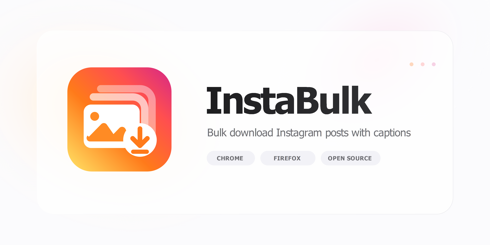

# InstaBulk Profile Downloader

Browser extension for downloading Instagram profile content.

<p align="center">
  
  
  
  
  
  
</p>

---

> [!NOTE]
>
> ## Getting started
>
> ```bash
> pnpm install
> pnpm dev          # Chrome (HMR on localhost:3303)
> pnpm dev-firefox  # Firefox (HMR on localhost:3303)
> ```
>
> Load `extension-chromium/` or `extension-firefox/` as an unpacked extension.

---

> [!TIP]
>
> ## Build
>
> Each browser builds to its own directory.
>
> | Command | Target | Output |
> |---|---|---|
> | `pnpm build:chromium` | Chrome | `extension-chromium/` |
> | `pnpm build:firefox` | Firefox | `extension-firefox/` |
> | `pnpm build:all` | Both | both directories |
>
> ### Package
>
> ```bash
> pnpm pack:zip       # Chrome Web Store
> pnpm pack:xpi       # Firefox Add-ons
> pnpm package:all    # both at once
> ```

---

> [!IMPORTANT]
>
> ## Release
>
> ```bash
> pnpm version patch|minor|major
> pnpm release:tag
> git push && git push --tags
> ```
>
> What happens next:
>
> 1. The local `pre-push` hook validates that any pushed `v*` tag matches `package.json` version.
> 2. GitHub Actions runs on tag push, verifies the tag again, then runs `pnpm lint`, `pnpm typecheck`, and `pnpm test`.
> 3. The workflow builds browser artifacts and publishes a GitHub Release with semantic filenames under `release/`.
>
> Produced artifacts:
>
> ```text
> instabulk-profile-downloader-<version>-chromium.zip
> instabulk-profile-downloader-<version>-firefox.xpi
> ```
>
> ### Checks
>
> ```bash
> pnpm typecheck
> pnpm lint
> pnpm test
> ```

---

## License

MIT. This project is based on the `vitesse-webext` template by Anthony Fu. The original MIT copyright notice is preserved in `LICENSE`.
